# 
**JuShoppingmall**

## Shoppingmall

### 기간 : 2022.8.22 ~ 2022.8.29

### 개발자 : 주병현,안주영, 장지원

### 본인 역할

## 백엔드 및 프론트엔드

- ### 백엔드

- **로그인**

  - Mysql을 이용한 로그인 구현
  
  - JWT를 이용한 로그인 유지

- **회원가입**

  - Mysql을 이용한 회원가입 구현

- ** Mysql설계 **

  - 로그인 : 로그인에 필요한 쇼핑몰 유저 저장

  - 회원가입 : 유입된 회원들을 저장할 수 있는 저장소 구현
  
  - 장바구니 : 유저들이 마음에 드는 상품을 골라 담을 수 있는 저장공간 구현

- **프론트**

  - 메인 페이지 구현

  - 장바구니 페이지 구현

---

## 목차

- [**개요**](https://github.com/acca3434/AJJShopingmall#%EA%B0%9C%EC%9A%94)
- [**사용기술**](https://github.com/acca3434/AJJShopingmall#%EC%82%AC%EC%9A%A9-%EA%B8%B0%EC%88%A0)
  - [전체 데이터베이스](https://github.com/acca3434/AJJShopingmall#%EC%A0%84%EC%B2%B4-%EB%8D%B0%EC%9D%B4%ED%84%B0%EB%B2%A0%EC%9D%B4%EC%8A%A4)
  - [메인 페이지](https://github.com/acca3434/AJJShopingmall#%EB%A9%94%EC%9D%B8-%ED%8E%98%EC%9D%B4%EC%A7%80
)
  - [안주영 페이지 클릭](https://github.com/acca3434/AJJShopingmall#%EC%95%88%EC%A3%BC%EC%98%81-%ED%8E%98%EC%9D%B4%EC%A7%80-%ED%81%B4%EB%A6%AD
)
  - [주병현 페이지 클릭](https://github.com/acca3434/AJJShopingmall#%EC%A3%BC%EB%B3%91%ED%98%84-%ED%8E%98%EC%9D%B4%EC%A7%80-%ED%81%B4%EB%A6%AD)
  - [장지원 페이지 클릭](https://github.com/acca3434/AJJShopingmall#%EC%9E%A5%EC%A7%80%EC%9B%90-%ED%8E%98%EC%9D%B4%EC%A7%80-%ED%81%B4%EB%A6%AD)
  - [회원가입 페이지](https://github.com/acca3434/AJJShopingmall#%ED%9A%8C%EC%9B%90%EA%B0%80%EC%9E%85-%ED%8E%98%EC%9D%B4%EC%A7%80)
  - [로그인 페이지](https://github.com/acca3434/AJJShopingmall#%EB%A1%9C%EA%B7%B8%EC%9D%B8-%ED%8E%98%EC%9D%B4%EC%A7%80)
  - [로그인 후 페이지(JWT 로그인 유지)](https://github.com/acca3434/AJJShopingmall#%EB%A1%9C%EA%B7%B8%EC%9D%B8-%ED%9B%84-%ED%8E%98%EC%9D%B4%EC%A7%80jwt-%EB%A1%9C%EA%B7%B8%EC%9D%B8-%EC%9C%A0%EC%A7%80)
  - [유저 베스트 검색 실시간 페이지](https://github.com/acca3434/AJJShopingmall#%EC%9C%A0%EC%A0%80-%EB%B2%A0%EC%8A%A4%ED%8A%B8-%EA%B2%80%EC%83%89-%EC%8B%A4%EC%8B%9C%EA%B0%84-%ED%8E%98%EC%9D%B4%EC%A7%80)
  - [출석체크 페이지](https://github.com/acca3434/AJJShopingmall#%EC%B6%9C%EC%84%9D%EC%B2%B4%ED%81%AC-%ED%8E%98%EC%9D%B4%EC%A7%80)
  - [챗봇 페이지](https://github.com/acca3434/AJJShopingmall#%EC%B1%97%EB%B4%87-%ED%8E%98%EC%9D%B4%EC%A7%80)
  - [장바구니 리모콘 페이지](https://github.com/acca3434/AJJShopingmall#%EC%9E%A5%EB%B0%94%EA%B5%AC%EB%8B%88-%EB%A6%AC%EB%AA%A8%EC%BD%98-%ED%8E%98%EC%9D%B4%EC%A7%80)
  - [장바구니 기능](https://github.com/acca3434/AJJShopingmall#%EC%9E%A5%EB%B0%94%EA%B5%AC%EB%8B%88-%EA%B8%B0%EB%8A%A5)
- [**기타 파일**](https://github.com/acca3434/AJJShopingmall#%EA%B8%B0%ED%83%80-%ED%8C%8C%EC%9D%BC)
  - [안주장 쇼핑몰의 정의](https://github.com/acca3434/AJJShopingmall#%EC%95%88%EC%A3%BC%EC%9E%A5-%EC%87%BC%ED%95%91%EB%AA%B0%EC%9D%98-%EC%A0%95%EC%9D%98)
  - [구현한기능](https://github.com/acca3434/AJJShopingmall#%EA%B5%AC%ED%98%84%ED%95%9C-%EA%B8%B0%EB%8A%A5)
  - [회의록들](https://github.com/acca3434/AJJShopingmall#%ED%9A%8C%EC%9D%98%EB%A1%9D%EB%93%A4)
---

## **개요**

### **Scripts**

`npm start`

---

## 사용 **기술**

 

 
 

 

---

### 전체 데이터베이스

 

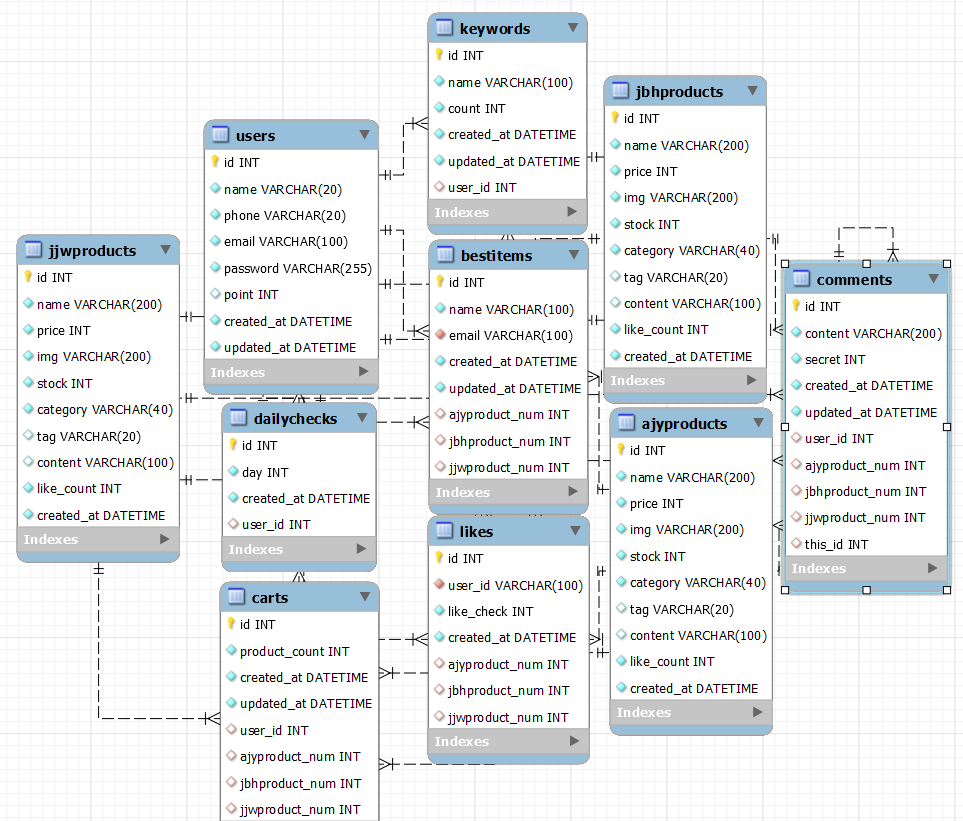

 

### 메인 페이지

 

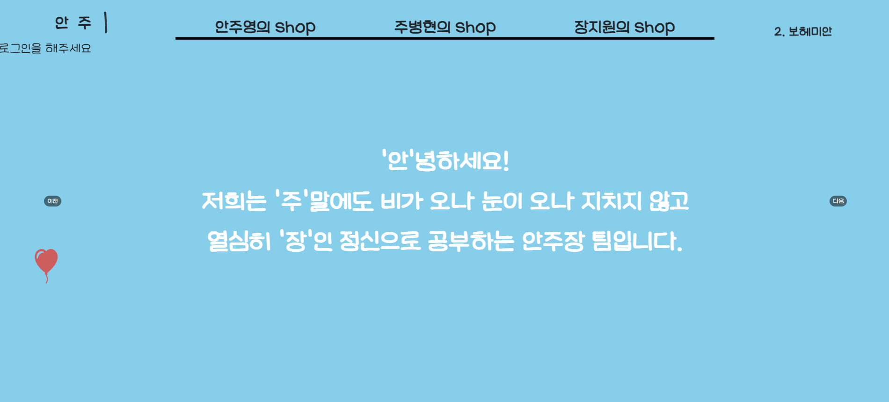

 

## 페이지를 누르면 각 디자이너의 쇼핑몰이 나옴

### 안주영 페이지 클릭

 

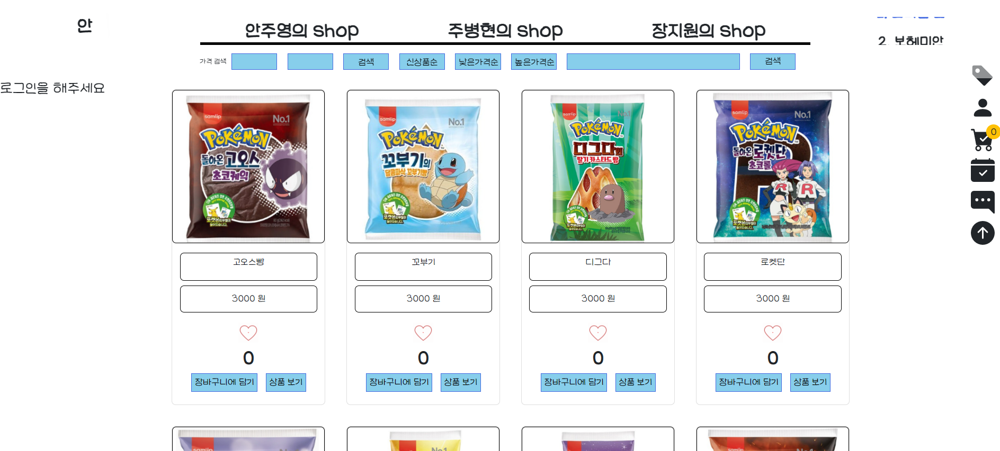

 

###  주병현 페이지 클릭

 

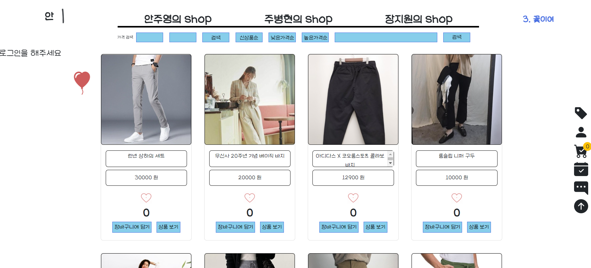

 

###  장지원 페이지 클릭

 

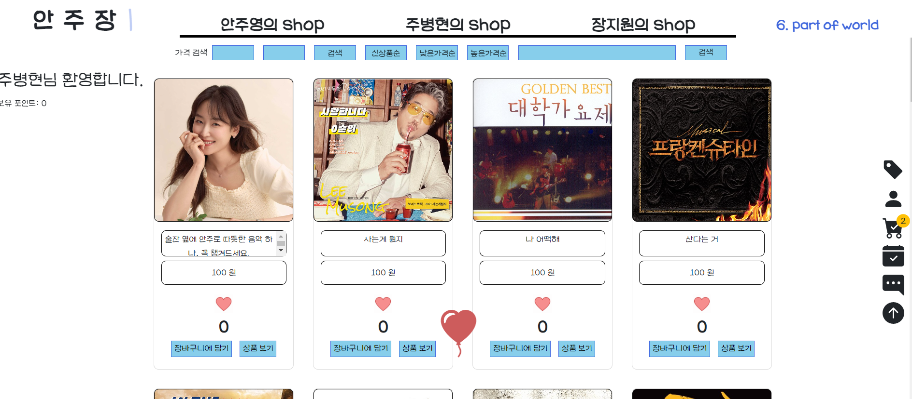

 

### 회원가입 페이지

- 로그인이 진행된 유저에게는 회원가입 버튼이 눌려지지 않게 기능구현
- 회원가입시 정규식을 정해놓아 정해진 규칙을 누르지 않으면 회원가입 자체가 안됌

 

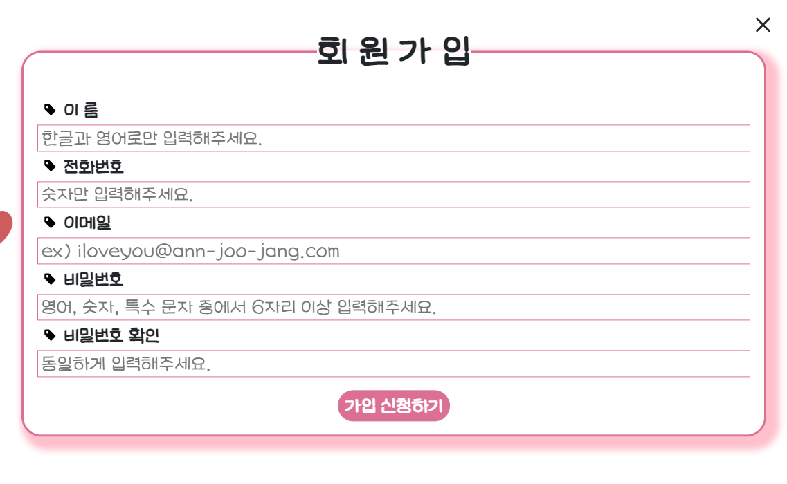

 

### 로그인 페이지

- 로그인이 완료된 사용자는 회원가입이 진행되지 않음
- JWT로 로그인 유지 기능 구현

 

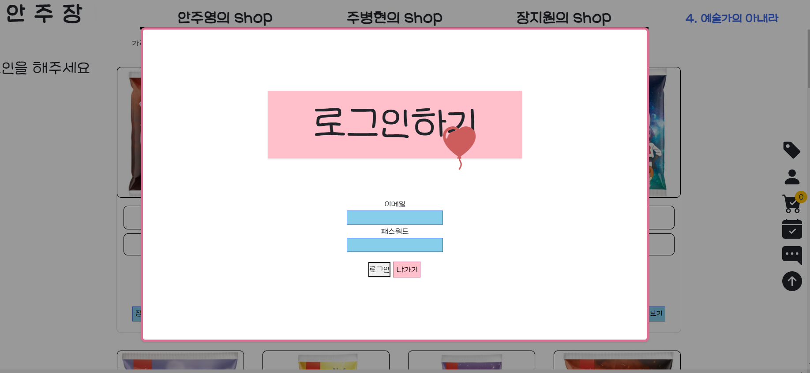

 

### 로그인 후 페이지(JWT 로그인 유지)

 

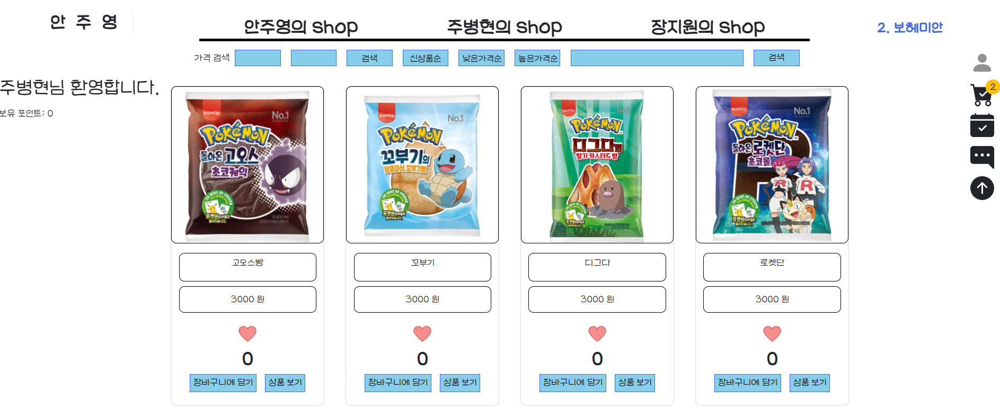

 

### 유저 베스트 검색 실시간 페이지

- 유저가 가장 많이 검색한 음원에 대해서 실시간으로 노출되는 공간

 

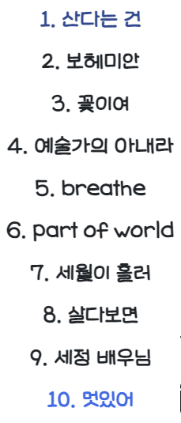

 

### 출석체크 페이지

- 유저가 출석체크를 한다면 마일리지 포인트가 쌓인다.
- 하루에 한번씩 출석체크 가능
- 출석이 다 됐다면 색깔변형으로 출석체크 중복 방지

 

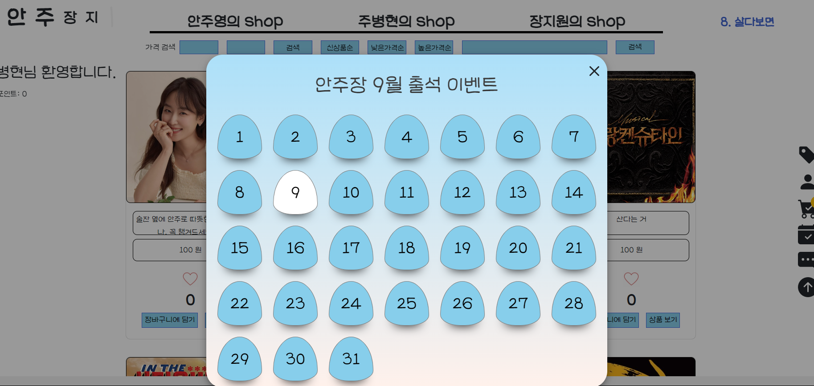

 

### 챗봇 페이지

- 챗봇은 실시간으로 사용자의 말을 기억하는것으로 구현하는것이 아닌 
- 상담원으로 바로 연결하기 위해 정해진 답변을 내놓고 상담원과
- 바로 연결한다

 

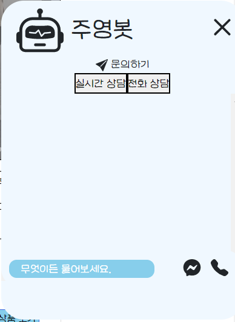

 

- 유저가 마음에 드는 쇼핑몰의 물건을 누르면 장바구니에 담기는 기능이다.

### 장바구니 리모콘 페이지

 

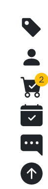

 

### 장바구니 기능

- 삭제하기,구매하기 기능구현.

- 버튼을 누르면 삭제와 구매가 가능하다.

- 총 금액기능 

 

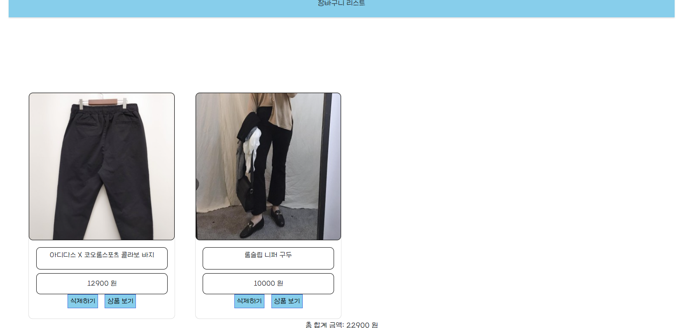

 
=======
09.03.10-# AJJShoppingMall

# 기타 파일

## 안주장 쇼핑몰의 정의

https://cuddly-petroleum-f3d.notion.site/AJJ-dfb013b2cafa46678509f7e1bf327b4b

## 구현한 기능

https://cuddly-petroleum-f3d.notion.site/ad3b8b0e0db1451d9fe62660d1a5378c

## 회의록들

https://cuddly-petroleum-f3d.notion.site/2f508307056d4af8afbf3bf35a4b776e?v=f4d177d3c9054c1f9457342a02246a57
